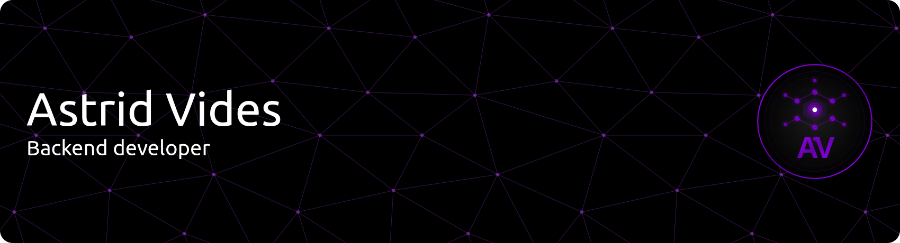

<!-- 
  
 -->

## Hey!, I'm Astrid Vides 

### Glad to see you here! :octocat:

I am a passionate **Backend Developer** who loves to code and solve programming challenges. I find joy in conceptualizing web solutions and coming up with new ideas using technology.

I currently reside in San Salvador, El Salvador. I am pursuing my Bachelor's degree in Computer Engineering at the prestigious Universidad Centroamericana José Simeón Cañas (UCA), where I am currently in my 4th year.

Beyond my learning, I find great satisfaction in sharing my knowledge and skills with others in the tech community. When I have some free time, I enjoy reading technical articles and playing video games.

My goals are to continuously improve my skills, build impactful projects, and ultimately apply my abilities to create value for organizations and people through software. I am excited by the prospect of contributing my passion and creativity to your amazing team.

---

### :blush: Talking about Personal Stuffs 

-  💻 &nbsp; I love exploring new tech stacks and building cool stuff
-  📰 &nbsp; Reading tech blogs whenever possible 
-  🍕 &nbsp; Travelling, meetups & tech events 
-  🚀 &nbsp; I'm currently learning Full Stack Web Development 
-  :computer: &nbsp; Most written code line `console.log("hello world");` 
-  👨🏻‍💻 &nbsp; Most of my projects are available on [Github](https://github.com/AstridVides)
-  📝 &nbsp; Checkout [my Resume](https://drive.google.com/file/d/1pIQgHIF0V-tZrSSUESsKiX28gynsIv9a/view?usp=sharing)
&nbsp; &nbsp; &nbsp;

 &nbsp;
 &nbsp;

---

### :dart: Languages and Tools 

> Tools, languages, and other things that I like to work with 

### 💻 Languages

### 🎨 Frontend

### ⚙️ Backend & Frameworks

### 🗄️ Databases

### 📊 Data analysis & BI
  

### 📝 Microsoft
  

### ☁️ Cloud & Service

### 📦 Package Manager

### 🧪 Testing

### 🔧 Tools & DevOps

### 🎯 IDEs

### 🎨 Design & Testing APIs

 &nbsp;
---

### ☄️ Github Streaks:

    

### ⚡ Github Stats:

  
  

  <picture>
    <source
      media="(prefers-color-scheme: dark)"
      srcset="https://raw.githubusercontent.com/platane/snk/output/github-contribution-grid-snake-dark.svg"
    />
    <source
      media="(prefers-color-scheme: light)"
      srcset="https://raw.githubusercontent.com/platane/snk/output/github-contribution-grid-snake.svg"
    />
    
  </picture>

<!-- 

  
 🎧 I'm Listening Now:

	

 -->
  
<!-- 

 -->
